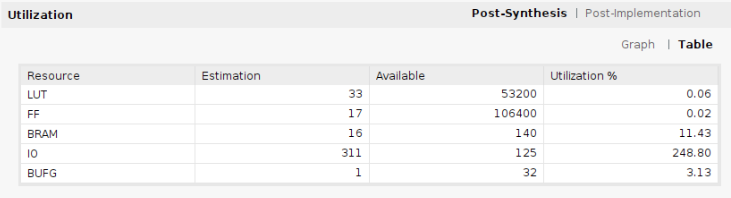
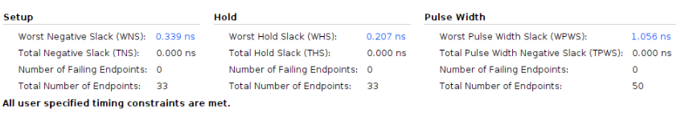

# SOC Design LAB4-1

## Overview
- This project can extend the capability of caravel soc with FIR operation.
- We add software FIR operation.
## Run code 
1. You need to build caravel soc environment (toolchain) on Linux.
2. Clone the repo and cd to testbench dir.
3. cd to the counter_la_fir.
```
cd ./lab-exmem_fir/testbench/counter_la_fir
```
 
4. Run the following command, and the result would display on the terminal.
```
source run_clean
source run_sim
```

## Results
1. Execute

2. Usage

2. Timing

